<div align="center">

[](https://git.io/typing-svg)


[](https://github.com/khanmassab)
[](https://www.linkedin.com/in/massab-khan-backendengineer/)

</div>

```ascii
╔═══════════════════════════════════════════════════════════════════╗
║  🎯 Tech Lead @ Horizon Digital | Pakistan 🇵🇰 → Australia 🇦🇺       ║
║  🎓 M.Sc Computer Science | Backend Architect | System Designer   ║
║  💻 Laravel • Go • NodeJS • AWS • Docker • CI/CD Automation       ║
╚═══════════════════════════════════════════════════════════════════╝
```

<br>

## 🚀 What I'm Building Right Now

```yaml
current_focus:
  role: "Technical Team Lead at Horizon Digital"
  building: ["AI-powered microservices", "scalable APIs", "cloud automation"]
  learning: ["AI agentic systems", "advanced Go patterns", "distributed systems"]
  goals_2025: ["Launch 5+ production systems", "grow engineering team", "open-source contributions"]
```

<br>

## 🛠️ Tech Arsenal

<div align="center">

### Backend & Languages


### Frontend & Frameworks


### Cloud & DevOps


### Database & Tools


</div>

<br>

## 📊 GitHub Stats

<div align="center">
  
  
</div>

<div align="center">
  
</div>

<div align="center">
  
</div>

<br>

## 🏆 GitHub Trophies

<div align="center">
  
</div>

<br>

## 💼 Journey Timeline

```mermaid
%%{init: {'theme':'dark'}}%%
timeline
    title My Tech Journey
    2018-2020 : Bachelor's Degree : Accounting & Commerce
    2020-2022 : Master's in CS : Ghazi University
    2021-2023 : Laravel Developer : Vigorous Technologies
    2024-2025 : Senior Engineer : DevStudio : Employee of the Year 🏆
    2025-Now  : Tech Lead : Horizon Digital : Leading AI Teams 🚀
```



<br>

## 🎯 Current Mission

<table>
<tr>
<td width="50%">

### 🔥 Working On
```javascript
const massab = {
  role: "Tech Lead",
  company: "Horizon Digital",
  location: "🇵🇰 → 🇦🇺",
  focus: [
    "Microservices Architecture",
    "AI Integration",
    "Team Leadership",
    "System Scalability"
  ],
  currentProjects: {
    backend: ["Laravel APIs", "Go Services"],
    devops: ["AWS Automation", "CI/CD Pipelines"],
    ai: ["Agentic Systems", "ML Integration"]
  }
};
```

</td>
<td width="50%">

### 📚 Learning & Exploring
- 🤖 AI Agentic Systems
- 🏗️ Advanced System Architecture
- ☁️ Cloud-Native Patterns
- 🔐 Zero-Trust Security
- 📊 Distributed Databases
- 🎯 Team Leadership Skills

### 🎖️ Recent Wins
- 🏆 Employee of the Year 2024
- 🚀 Leading Horizon Digital's Tech Team
- 💡 Multiple Production Launches

</td>
</tr>
</table>

<br>

## 🎓 Credentials

<details>
<summary>🎯 Click to expand certifications & education</summary>

### Education
- 🎓 **M.Sc Computer Science** — Ghazi University (2020-2022)
- 📚 **B.Com Accounting & Commerce** — Bahauddin Zakariya University (2018-2020)

### Certifications
- ✅ DevOps Project: CI/CD with GitLab, Jenkins & Laravel (Udemy, Oct 2024)
- ✅ Angular Fundamentals (Pluralsight, Feb 2025)
- ✅ Angular Reactive Forms (Pluralsight, Mar 2025)

</details>

<br>

## 💬 What Others Say

<table>
<tr>
<td>

> *"Massab is a brilliant developer with a knack for solving complex problems. His passion for coding and innovative thinking shines through."*
>
> **— Zeeshan Suleman**, Tech Entrepreneur

</td>
<td>

> *"A master of Laravel and NodeJS, Massab crafts robust, scalable web apps and fosters team excellence."*
>
> **— Abdullah**, IoT Engineer, DevStudio

</td>
</tr>
</table>

<br>

## 🌐 Let's Connect

<div align="center">

[](https://www.linkedin.com/in/massab-khan-backendengineer/)
[](https://khanmassab.github.io)
[](mailto:massab725@gmail.com)
[](https://x.com/khanmassab)

</div>

<br>

## 🎯 Quick Facts

```typescript
const quickFacts: DevProfile = {
  code: ["PHP", "Go", "JavaScript", "TypeScript", "SQL"],
  frameworks: ["Laravel", "NodeJS", "Express", "Vue.js", "Angular"],
  architecture: ["Microservices", "REST APIs", "Event-Driven", "MVC"],
  databases: ["MySQL", "PostgreSQL", "Redis"],
  cloud: ["AWS", "Docker", "Jenkins", "CI/CD"],
  currentlyReading: "Building Microservices - Sam Newman",
  funFact: "I automate everything... even my coffee machine ☕️"
};
```

<br>

<div align="center">

### 💭 Dev Philosophy

**"Building systems that don't just work today, but scale tomorrow."**

*Clean Architecture × System Design × Team Empowerment*

---


</div>
